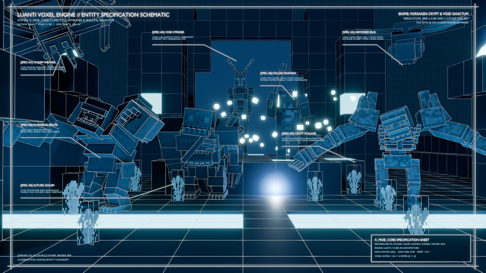

# X Mob Core [`x_mob_core`]

[](https://content.luanti.org/packages/SaKeL/x_mob_core/)
[](https://content.luanti.org/packages/SaKeL/x_mob_core/)

[](https://github.com/sakel-hub/x_mob_core/actions)
[](LICENSE.txt)
[](https://github.com/sakel-hub/x_mob_core/pulls)


A high-performance, **zero-dependency** mob engine and spawner framework for Luanti built on **S.O.L.I.D.** architecture principles.



---

## Features

- **Zero External Dependencies**: Operates exclusively with native Luanti engine C++ APIs (`core.*`).
- **3D A\* Hierarchical Pathfinding**:
  - Binary min-heap priority queue with zero-allocation push/pop operations.
  - Volumetric multi-ray corridor line-of-sight check bypassing expensive graph traversals.
  - LRU path caching and pre-cached Content ID (CID) flat lookups.
  - Asynchronous coroutine time-sliced path search with strict 1.5ms per-tick CPU budget.
- **Motor & Steering Controller**:
  - Pursuit-gated traversal (smart door opening, ladder climbing, liquid swimming).
  - Surface climbing and dynamic rotation interpolation.
  - Tactical retreat and flee steering vectors.
  - Multiplayer distance-based LOD execution and idle culling.
- **glTF Multi-Track Animator**:
  - Native Luanti glTF named track playback with priority blending and track transition clearing.
  - Zero-latency runtime playback speed scaling and looping track synchronization.
  - Frame-range fallback for legacy skeletal animations.
- **Combat & Damage Subsystems**:
  - Native tool capabilities calculation, damage groups, and weapon wear mechanics.
  - Directional damage particles (configurable blood, ichor, smoke, spectral, sparks) and damage indicator flashing.
  - Liquid knockback dampening and configurable knockback resistance multipliers.
  - Factions and allegiance system (`x_mob_core.are_allies`, `x_mob_core.are_enemies`).
  - Ballistic intercept aim prediction (`x_mob_core.predict_aim`) and projectile flight/collision pipeline (`x_mob_core.step_projectile`, `x_mob_core.is_valid_projectile_target`).
  - Declarative loot drop tables with radial parabolic fountain drops (`x_mob_core.drop_items`).
  - Procedural `[combine:` overhead health bars with 5-tier color palettes, proportional bounding box scaling, head clearance, and auto-resetting timeout windows.
  - Universal child, passenger, and arrow detachment on entity death.
- **Pack Coordination & Swarm Intelligence**:
  - Pack UUID generation, leader-follower registry, and automatic orphan adoption.
  - Spatial leash tethering, regroup steering vectors, and rally commands.
  - Shared threat and aggro broadcasting with cowardice panic propagation.
  - 3D Boids spatial separation with horizontal anti-stacking bias.
  - Aerial swarm flocking and coordinated dive-bomb combat patterns (`pack/swarm.lua`).
  - Aquatic shoal flocking and synchronized swimming (`pack/shoal.lua`).
  - Democratic leader election (`x_mob_core.elect_successor`) upon leader death.
- **Dynamic Natural Spawner**:
  - Mapgen population pass (`core.register_on_generated`) and player-proximity trickle loop without ABMs.
  - Dynamic ground filtering from registered spawn node lists and group definitions (`group:soil`, `group:stone`).
  - Cohesive group spawning with safe radial distribution (`x_mob_core.spawn_mob_group`).
  - Detailed environmental condition filters: light thresholds, time-of-day windows, elevation limits, and density caps.
- **Lifecycle, Pipeline & Event Bus**:
  - Prioritized step middleware pipeline (`x_mob_core.register_step_hook`) for modular gameplay expansions.
  - Entity-tied action scheduler (`x_mob_core.schedule`) safe against entity death and despawning.
  - Pub-sub event bus (`listen`, `unlisten`, `emit`) for decoupled mod hooks (`on_mob_spawn`, `on_mob_death`, `on_mob_target`, `on_mob_damage`).
- **Positional Audio Subsystem**:
  - Spatial distance attenuation and pitch randomization for hurt, death, attack, ambient, and alert sound cues.

---

## Architecture

```text
x_mob_core/
├── mod.conf                 # Mod metadata and dependencies
├── .cdb.json                # ContentDB package metadata
├── LICENSE.txt              # MIT License
├── README.md                # Mod documentation and showcase
├── API.md                   # Complete API reference and EmmyLua documentation
├── settingtypes.txt         # Engine configuration settings
├── api.lua                  # Public API namespace 'x_mob_core'
├── init.lua                 # Bootstrap entry point
├── core/
│   ├── types.lua            # EmmyLua type definitions and interfaces
│   ├── utils.lua            # UUID generator, line-of-sight, ground scan helpers
│   └── events.lua           # Event bus registry (pub/sub)
├── navigation/
│   ├── min_heap.lua         # Binary min-heap priority queue
│   ├── path_cache.lua       # Content ID and path cache
│   ├── fast_pathfinder.lua  # Volumetric raycasts and 3D A* search
│   └── mob_memory.lua       # Spatial memory blackboard
├── motor/
│   ├── node_cache.lua       # Cached VoxelArea & node lookups
│   ├── doors.lua            # Door opening detection and interaction
│   ├── surface.lua          # Surface alignment and rotation interpolation
│   ├── safety.lua           # Aquatic detection, shore finding, step safety checks
│   ├── locomotion.lua       # Yaw, velocity, liquid buoyancy, wall collision, movement
│   └── mob_ai.lua           # Navigation coordinator (pursuit-gating, wander/move steps)
├── animation/
│   └── animator.lua         # glTF multi-track dispatcher
├── combat/
│   ├── damage.lua           # Damage calculation and tool wear
│   ├── knockback.lua        # Knockback physics dampening
│   ├── effects.lua          # Damage indication and directional particles
│   ├── factions.lua         # Faction allegiance and relationship checks
│   ├── shooter.lua          # Predictive intercept aiming, kiting, and projectile pipeline
│   ├── loot.lua             # Radial parabolic item drops and declarative drop tables
│   └── detachment.lua       # Child, passenger, and arrow detachment on death
├── spawning/
│   ├── registry.lua         # Spawn rule registry
│   ├── conditions.lua       # Ground, light, elevation, density validators
│   └── engine.lua           # Mapgen and trickle spawner loops
├── pack/
│   ├── squad.lua            # Leader/follower tracking, orphan adoption, and leader election
│   ├── coordination.lua     # Spatial leash tethering and aggro broadcast
│   ├── swarm.lua            # 3D aerial flocking, vortex holding, and dive-bomb runs
│   └── shoal.lua            # Aquatic schooling, alignment, and separation
├── lifecycle/
│   ├── entity_wrapper.lua   # Engine entity registration adapter
│   ├── state_machine.lua    # State execution pipeline (idle, walk, combat, flee, custom)
│   ├── combat_handler.lua   # Universal combat punch intake and event dispatching
│   ├── culling.lua          # Multiplayer distance-based LOD and sleep culling
│   ├── environment.lua      # Node interaction, fall damage, and liquid buoyancy
│   ├── pipeline.lua         # Prioritized step middleware pipeline
│   └── properties.lua       # Dynamic property sync and scale management
└── audio/
    └── sound.lua            # Positional audio dispatcher and pitch variation
```

---

## API Quickstart

For full documentation of all classes, types, and methods, see [API.md](API.md).

### 1. Registering a Custom Mob

```lua
x_mob_core.register_mob("mymod:goblin", {
    initial_properties = {
        hp_max = 20,
        mesh = "mymod_goblin.glb",
        textures = {
            "mymod_goblin.png",
            "mymod_goblin.png^[colorize:#22aa55:30", -- Forest goblin variant
        },
        collisionbox = {-0.3, -0.01, -0.3, 0.3, 1.2, 0.3},
    },

    movement = {
        walk_speed = 3.0,
        run_speed = 4.5,
        can_swim = true,
        can_climb = true,
        can_open_doors = true,
    },

    combat = {
        damage = 4,
        reach = 2.0,
        aggro_radius = 16.0,
        knockback_mult = 0.8,
        damage_effect = {
            type = "blood",
            count = 10,
        },
    },

    animation = {
        tracks = {
            idle = "idle",
            walk = "walk",
            combat = "attack",
            death = "death",
        },
    },

    sounds = {
        hurt = "mymod_goblin_hurt",
        death = "mymod_goblin_death",
        random = "mymod_goblin_ambient",
        attack = "mymod_goblin_attack",
    },

    drops = {
        {name = "default:gold_lump", chance = 0.25, min = 1, max = 2},
        {name = "default:flint", chance = 0.50, min = 1, max = 3},
    },

    -- Optional Overhead Health Bar (Enabled by default; fully customizable)
    health_bar = {
        enabled = true,                     -- Enable overhead health bar for this mob
        width = 64,                         -- Texture canvas width in px
        height = 8,                         -- Texture canvas height in px
        timeout = 4.0,                      -- Duration before auto-hiding (resets on damage)
        auto_scale = true,                  -- Proportional scaling relative to mob bounding box
        spacing = 0.35,                     -- Vertical clearance above collisionbox top
        colors = {
            { threshold = 0.80, color = "#00FF00" }, -- Emerald Green
            { threshold = 0.60, color = "#7CFC00" }, -- Lime
            { threshold = 0.40, color = "#FFD700" }, -- Gold
            { threshold = 0.20, color = "#FF8C00" }, -- Dark Orange
            { threshold = 0.00, color = "#FF2200" }, -- Crimson Red
        },
    },

    -- Health Regeneration & Tactical Fleeing (Built-in default: 0.5 HP/s while running away)
    health_regen = {
        rate = 1.0,                         -- HP regenerated per second (default: 0.5)
        overlay = true,                     -- Flash white texture overlay on heal tick (default: true)
        overlay_color = "^[colorize:#FFFFFF60", -- Custom overlay tint (default: white)
        passive = false,                    -- Enable passive recovery when not fleeing (default: false)
        flee_threshold = 10,                -- HP to trigger fleeing (default: 25% max HP)
        return_threshold = 24,              -- HP to exit fleeing & re-engage (default: 60% max HP)
    },

    -- Optional Pack Mechanics (Handled automatically by x_mob_core)
    pack = {
        role = "member",
        leader_type = "mymod:goblin_chief",
        leash_distance = 16.0,
        regroup_distance = 4.0,
        on_leader_lost = function(self)
            self.state = "fleeing"
        end,
    },

    -- Optional Custom States
    custom_states = {
        ["dance"] = {
            enter = function(self)
                x_mob_core.play_animation(self.object, "dance")
            end,
            step = function(self, dtime)
                -- Custom state logic
            end,
            exit = function(self)
                x_mob_core.stop_animation(self.object, "dance")
            end,
        }
    },
})
```

### 2. Registering Natural Spawning

```lua
x_mob_core.register_spawn("mymod:goblin", {
    nodes = {"group:soil", "default:dirt_with_grass", "default:stone"},
    chance = 2000,
    active_object_count = 3,
    group_min = 2,
    group_max = 4,
    min_light = 0,
    max_light = 12,
    min_elevation = -31000,
    max_elevation = 31000,
})
```

### 3. Event Bus Integration

Listen to decoupled lifecycle and combat events:

```lua
x_mob_core.listen("on_mob_death", function(self, puncher)
    if puncher and puncher:is_player() then
        core.chat_send_player(puncher:get_player_name(), "You vanquished " .. self.name .. "!")
    end
end)
```

### 4. Step Pipeline Middleware

Inject custom logic into the entity update loop without modifying core files:

```lua
x_mob_core.register_step_hook("mymod:freeze_aura", 50, function(self, dtime, def, moveresult)
    if self.is_frozen then
        x_mob_core.halt_horizontal_velocity(self)
        return true -- Halts subsequent pipeline steps
    end
end)
```

---

## Configuration & Settings

Configurable via `minetest.conf` or the Luanti **Settings -> Mod Settings** UI:

| Setting | Type | Default | Description |
|:---|:---|:---|:---|
| `x_mob_damage_particles` | `enum` | `mob_default` | Visual damage particle style (`mob_default`, `blood`, `smoke`, `ichor`, `spectral`, `sparks`, `none`). |
| `x_mob_damage_particle_multiplier` | `float` | `1.0` | Global particle count scaling multiplier (`0.0` to `3.0`). |

---

## Multiplayer Performance & Benchmarks

`x_mob_core` includes an automated load, performance, and stress test benchmark suite comparing major Luanti mob frameworks (**Mobs Redo API**, **Creatura**, and **X Mob Core**).

### Running the Benchmark Suite

Execute via standard Lua or npm:

```bash
# Direct Lua execution
lua test_multiplayer_perf.lua

# Or via npm script
npm run test:perf
```

### Benchmark Summary (Extreme Surge: 150 Mobs, 60 Concurrent Players)

| Metric | Mobs Redo API (`mobs_redo`) | Creatura (`creatura`) | X Mob Core (`x_mob_core`) | Advantage / Improvement |
|:---|:---|:---|:---|:---|
| **Average Step Latency** | `1,758.5 µs/tick` | `1,029.3 µs/tick` | **`553.3 µs/tick`** | **3.18x faster** than Mobs Redo, **1.86x faster** than Creatura |
| **Peak Tick Latency** | `3,252.0 µs` | `2,739.0 µs` | **`1,033.0 µs`** | **3.15x lower spikes**, preventing tick jitter |
| **Server TPS (20 Target)** | `20.0 TPS` | `20.0 TPS` | **`20.0 TPS`** | **98.9% tick headroom** |
| **Max Capacity (15ms Budget)** | `~1,279 mobs` | `~2,185 mobs` | **`~4,066 mobs`** | **3.18x higher entity capacity** |
| **Node / Map Queries** | `709,518 queries` | `101,369 queries` | **`4,390 queries`** | **99.38% reduction** in map queries |
| **A\* Path Searches** | `17,591 searches` | `2,841 searches` | **`146 searches`** | **99.17% reduction** via Corridor LOS & LOD |
| **Corridor Fast-Path Bypasses** | `0 (N/A)` | `0 (N/A)` | **`4,908 bypasses`** | Zero-overhead straight-line pursuit |
| **Lua GC Memory Rate** | `12,681.1 KB/s` | `4,070.8 KB/s` | **`392.6 KB/s`** | **32.30x lower memory churn** |
| **Network Egress Bandwidth** | `6,348.56 KB/s` | `6,592.43 KB/s` | **`5,636.73 KB/s`** | **11.2% to 14.5% bandwidth reduction** |

For complete multi-scenario tables (Concurrency Scaling, Entity Density, Obstacle Stress, and Distance LOD), see [benchmark_results.md](benchmark_results.md).
